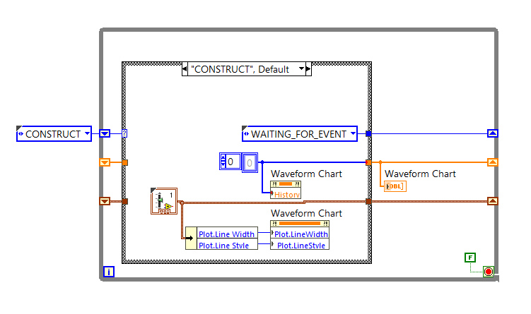

# NI LabVIEW Test  

A repository for experimenting with **National Instruments LabVIEW**. This repo contains small projects built while learning and practicing **LabVIEW basics**.  

## Projects  

### 1. Timer State Machine
  
- Implements a simple **state machine** that acts as a simple timer timer.  
- Demonstrates how to use states (e.g., Running, Stopped) and transitions.
- Coverage: state machine

### 2. Counter State Machine
  
- A state machine that behaves as a **counter**.  
- Shows how to increment and decrement values based on state transitions.  
- Coverage: state machine

### 3. Random Number Analyzer

- A state machine that analyzes an array of number visualized with waveform graph.
- Shows basic stats function implementation on state transitions.
- Coverage: state machine, project organization

### 4. Wave Graph Configuration

- Demonstrates how to configure a Waveform Chart dynamically using a cluster of settings (line style, line width, etc.).
- Uses popup subVIs as dialogs for editing configuration, applying changes live to the chart.
- Coverage: clusters, typedefs, property nodes, dialog subVIs